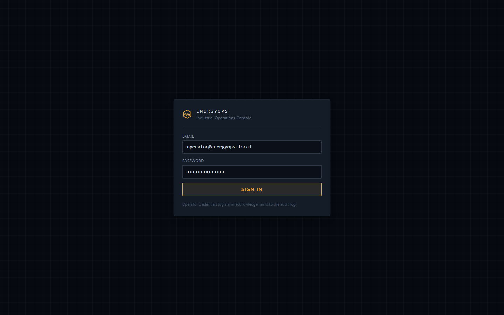
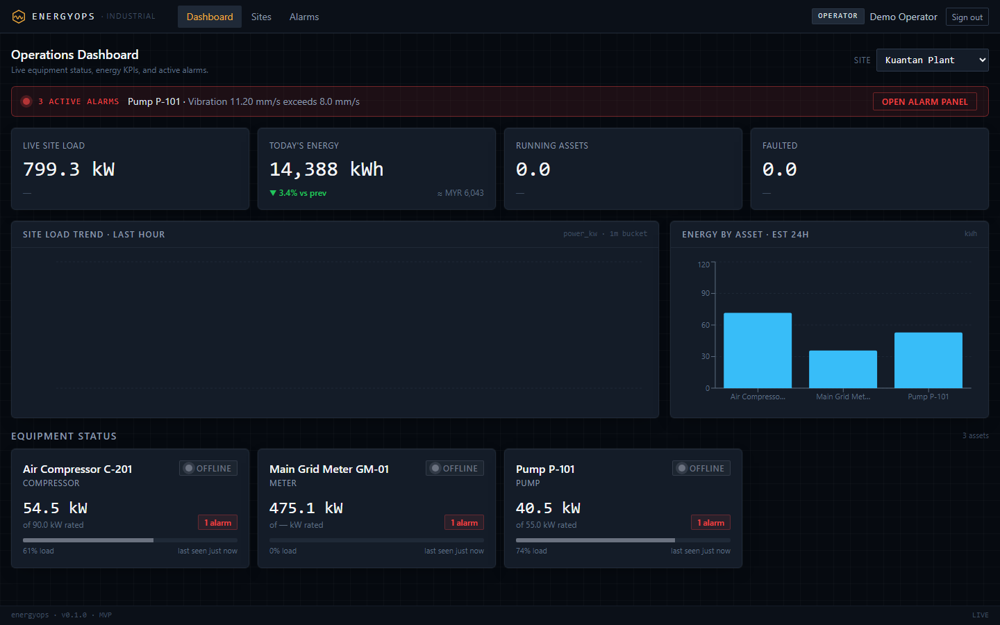
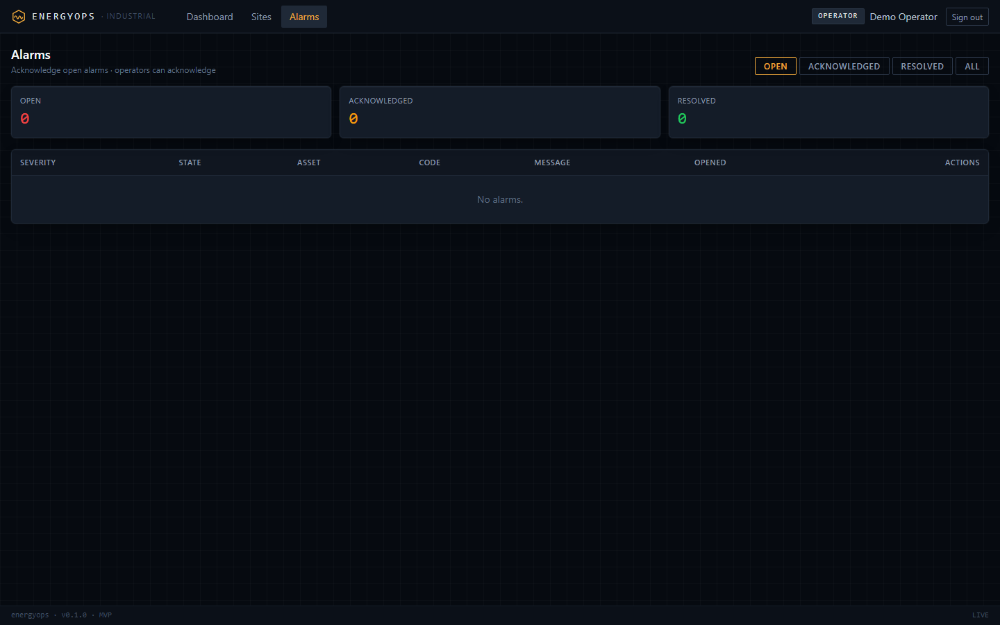
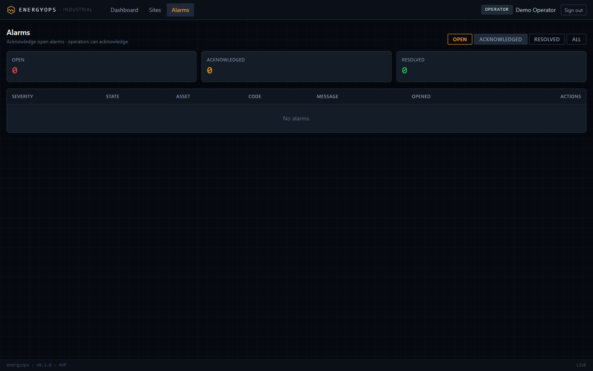
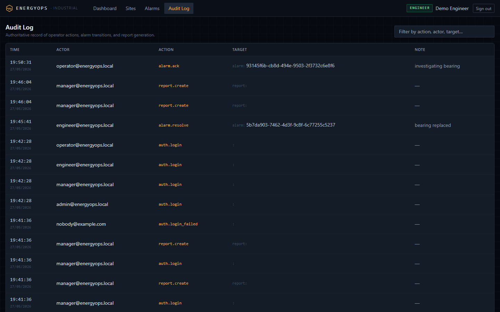
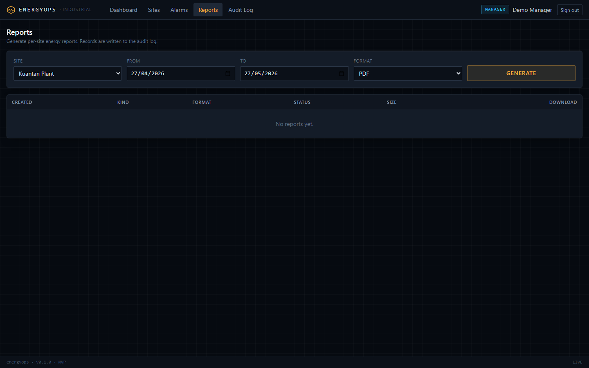
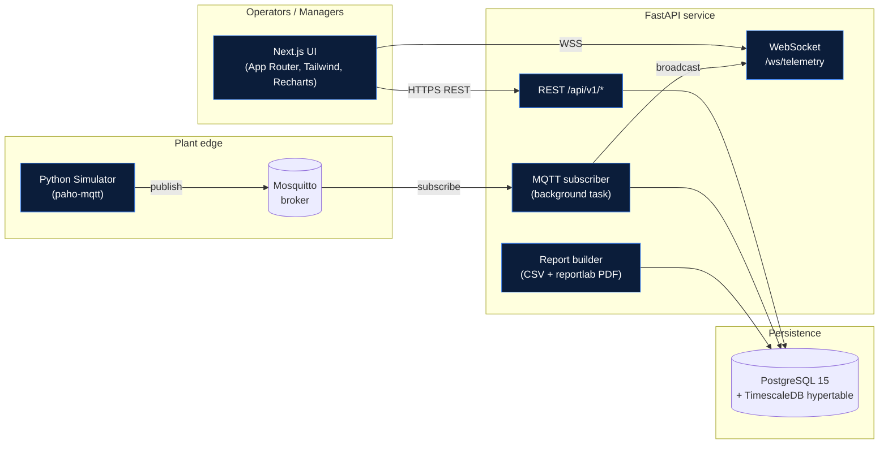

# Industrial EnergyOps Dashboard

[](#quick-start)
[](#tech-stack)
[](#tech-stack)
[](#tech-stack)
[](#tech-stack)
[](#license)

> A SCADA-inspired, full-stack industrial monitoring platform you can boot with one command.

EnergyOps is a portfolio project that demonstrates how a small team would
build a multi-tenant industrial energy operations dashboard end-to-end:
real-time MQTT telemetry from simulated plant assets, a FastAPI backend
backed by TimescaleDB hypertables, role-based workflows for operators and
managers, and a Next.js dashboard that streams live readings over a
WebSocket.

It is **not** affiliated with Schneider EcoStruxure, Siemens MindSphere, or
GE Digital. The architecture is original; only the *category* of platform
is being emulated.

---

## Table of contents

- [Project pitch](#project-pitch)
- [Screenshots](#screenshots)
- [Architecture](#architecture)
- [Features](#features)
- [Tech stack](#tech-stack)
- [Quick start](#quick-start)
- [Demo accounts](#demo-accounts)
- [Demo scenario](#demo-scenario)
- [API overview](#api-overview)
- [Database overview](#database-overview)
- [MQTT topic overview](#mqtt-topic-overview)
- [Folder tree](#folder-tree)
- [Make targets](#make-targets)
- [Recruiter talking points](#recruiter-talking-points)
- [Troubleshooting](#troubleshooting)
- [Known limitations and production roadmap](#known-limitations-and-production-roadmap)
- [License](#license)

---

## Project pitch

Industrial sites run a long tail of pumps, compressors, chillers,
inverters, and meters. Operators need a single pane of glass that shows:

- which assets are healthy right now,
- which alarms need acknowledgement,
- how much energy each asset is burning, and
- what the trend looks like over the last shift.

EnergyOps is a junior-buildable, original platform that does exactly
that. Five seeded assets across three sites publish synthetic but
plausible telemetry through MQTT every five seconds. The backend
ingests, persists, and re-broadcasts the readings. The frontend renders
KPI tiles, an asset tree, an alarm queue, trend charts, and an exportable
energy report. Four demo roles (operator, engineer, manager, admin) gate
who can do what.

The whole stack boots with **one command**: `docker compose up --build`.

## Screenshots

Captured against the live demo stack via `docker compose up --build`.

| Page | Capture |
|------|---------|
| Login |  |
| Operator dashboard (live telemetry) |  |
| Active alarm |  |
| Acknowledged alarm |  |
| Audit log |  |
| Reports / energy export |  |

## Architecture



Read `docs/ARCHITECTURE.md` for the longer-form walkthrough including the
write path, read path, and report path.

## Features

- **Real-time telemetry** for power, current, voltage, vibration, flow,
  pressure, temperature, and energy across five assets per tick.
- **Plant hierarchy** modelled the way a SCADA team would expect:
  `company → site → area → asset → sensor`.
- **Alarm workflow** with `OPEN → ACK → RESOLVED` states, severity
  levels (`info / warning / critical`), and an idempotent OPEN-alarm
  guard via a partial unique index.
- **Role-based access** enforced in a single FastAPI dependency:
  `operator < engineer < manager < admin`.
- **Energy report exports** in CSV (stdlib) and PDF (`reportlab`),
  manager-gated, with site / asset / time-range filters.
- **Audit log** that captures `auth.login`, `alarm.ack`, `alarm.resolve`,
  and seed events; engineer+ can inspect it.
- **TimescaleDB hypertable** for telemetry plus a continuous aggregate
  (`telemetry_5m`) for fast historical reads.
- **WebSocket fan-out** so the dashboard updates without polling.
- **Anomaly injection** in the simulator (vibration spike, high
  temperature, high power draw, low solar output, voltage dip) with a
  configurable fault probability.
- **Three deterministic demo runs**: long-running default, `--smoke`
  burst, and `--once` single-tick.

## Tech stack

| Layer        | Tech                                                  |
|--------------|-------------------------------------------------------|
| Frontend     | Next.js 14 (App Router), TypeScript, Tailwind, Recharts |
| Backend API  | FastAPI 0.115 (Python 3.11), Uvicorn, Pydantic v2     |
| Database     | PostgreSQL 15 + TimescaleDB extension                 |
| Streaming    | Eclipse Mosquitto 2 (MQTT 3.1.1, MQTT-WS on :9001)    |
| Simulator    | Python 3.11, `paho-mqtt`                              |
| Auth         | JWT bearer tokens (HS256), bcrypt password hashing    |
| Reports      | CSV (stdlib) + PDF (`reportlab`)                      |
| Tests        | pytest, vitest, FastAPI `TestClient`                  |
| Deployment   | Docker Compose                                        |

## Quick start

You need Docker Desktop (or any Docker engine + the `docker compose`
plugin). That is the only host requirement.

```bash
# 1. clone and enter
git clone <your-fork-url> energyops-simulator
cd energyops-simulator

# 2. copy the env template (edit secrets if you want)
cp .env.example .env

# 3. boot the whole stack
docker compose up --build
```

Wait for `energyops-backend` to print `Application startup complete.` and
for `energyops-simulator` to start logging `publish industrial/...`
lines.

```bash
# 4. seed demo data (one shot, idempotent)
docker compose exec backend python -m app.seed
```

| Service     | URL                                              |
|-------------|--------------------------------------------------|
| Frontend    | http://localhost:3000                            |
| Backend API | http://localhost:8000/docs                       |
| Health      | http://localhost:8000/health                     |
| Mosquitto   | mqtt://localhost:1883 (ws://localhost:9001)      |
| PostgreSQL  | postgres://localhost:5432/energyops              |

To tear it all down:

```bash
docker compose down            # stop containers, keep volumes
docker compose down -v         # also drop the postgres + mqtt volumes
```

### Windows / PowerShell

`make` is not on the default Windows PATH. Use either raw
`docker compose` commands or the bundled PowerShell helpers under
`demo/`:

```powershell
# raw compose (works everywhere)
docker compose up --build
docker compose down

# helper scripts (mirror `make demo` and `make reset-db`)
pwsh -File demo/up.ps1       # build, start, wait for health, seed
pwsh -File demo/reset.ps1    # wipe DB, re-seed, restart simulator
```

The `Makefile` is a thin convenience wrapper for macOS / Linux. Every
target maps to a `docker compose` command you can run directly, so
nothing in this project requires `make`.

## Demo accounts

The seed script reads emails and passwords from environment variables. The
defaults below come straight from `.env.example`; rotate them in `.env`
before any real demo.

| Email                       | Default password   | Role     | What they can do                              |
|-----------------------------|--------------------|----------|-----------------------------------------------|
| `admin@energyops.local`     | `Admin#12345`      | admin    | everything + user management                  |
| `manager@energyops.local`   | `Manager#12345`    | manager  | hierarchy edits, reports, ack + resolve       |
| `engineer@energyops.local`  | `Engineer#12345`   | engineer | resolve alarms, edit assets, view audit log   |
| `operator@energyops.local`  | `Operator#12345`   | operator | view dashboards, acknowledge alarms           |

The login page pre-fills the operator credentials, so the fastest
recruiter path is `make up && make seed` followed by clicking **Sign in**.
The full role-permission matrix lives in `docs/API_CONTRACT.md`.

## Demo scenario

The seeded demo is intentionally simple: an operator catches an
in-progress pump anomaly, acknowledges it, then a manager exports an
energy report. Step-by-step instructions are in
[`docs/DEMO_SCRIPT.md`](docs/DEMO_SCRIPT.md). Quick version:

1. **Operator** logs in as `operator@energyops.local`, opens the
   dashboard, and notices `Pump P-101` flashing a `VIBRATION_HIGH`
   warning in the alarm banner.
2. They click into the alarm row, leave a note ("investigating
   bearing"), and acknowledge it. The alarm moves from `OPEN` to
   `ACK` and the audit log gains an `alarm.ack` entry.
3. **Manager** logs in as `manager@energyops.local`, opens the
   reports page, picks `Kuantan Plant` and the last 24 hours, and
   exports the energy report as PDF and CSV.
4. The PDF lands in `./reports/` on the host (volume-mounted) and
   downloads to the browser.

## API overview

REST endpoints are versioned at `/api/v1/*`; the same routers are also
mounted at the bare paths for convenience. Full schemas live in
`docs/API_CONTRACT.md`. Highlights:

| Method | Path                                     | Auth         | Notes                                    |
|--------|------------------------------------------|--------------|------------------------------------------|
| GET    | `/health`                                | public       | liveness + DB ping                       |
| POST   | `/auth/login`                            | public       | returns JWT + `<User>`                   |
| GET    | `/auth/me`                               | bearer       | current user                             |
| GET    | `/companies`, `/sites`, `/areas`         | bearer       | hierarchy reads                          |
| GET    | `/assets`, `/assets/{id}`                | bearer       | asset list + detail                      |
| GET    | `/assets/{id}/sensors`                   | bearer       | sensors for an asset                     |
| GET    | `/telemetry/latest`                      | bearer       | latest reading per asset                 |
| GET    | `/telemetry/history`                     | bearer       | bucketed history                         |
| GET    | `/alarms`                                | bearer       | filter by `state`, `site_id`, etc.       |
| POST   | `/alarms/{id}/acknowledge`               | operator+    | writes audit row                         |
| POST   | `/alarms/{id}/resolve`                   | engineer+    |                                          |
| GET    | `/reports/energy/summary`                | manager+     | KPI cards JSON                           |
| GET    | `/reports/energy.csv`                    | manager+     | streamed CSV, capped at 100k rows        |
| GET    | `/reports/energy.pdf`                    | manager+     | streamed PDF                             |
| GET    | `/audit-log`                             | engineer+    | filterable + paginated                   |
| WS     | `/ws/telemetry?token=<jwt>`              | bearer (qs)  | live telemetry / status / alarm events   |

Errors use a single envelope:

```json
{ "error": { "code": "ALARM_NOT_FOUND", "message": "...", "details": {} } }
```

OpenAPI is served at `/openapi.json` and Swagger UI at `/docs`.

> CSV exports are capped at 100,000 rows. The response always carries
> `X-Report-Truncated: true|false`, plus `X-Report-Row-Limit: 100000`
> when the cap was hit. For large windows, narrow the export with
> `start` / `end` and the `site_id` / `asset_id` filters, or use the
> PDF report (no row cap; aggregates instead). See
> [`docs/API_CONTRACT.md`](docs/API_CONTRACT.md#csv-export-row-cap).

## Database overview

```
companies ─┬─ users
           └─ sites ── areas ── assets ── sensors
                                  │
                                  ├─ alarms
                                  ├─ alarm_rules
                                  ├─ asset_status_history
                                  └─ telemetry  (TimescaleDB hypertable)
audit_log
reports
```

Key choices, all documented in `docs/DATA_MODEL.md`:

- **`telemetry` is a hypertable** partitioned on `ts` so the dashboard
  can scan recent windows quickly without indexing every column.
- **`telemetry_5m` continuous aggregate** pre-rolls 5-minute averages
  for chart endpoints.
- **One OPEN alarm per `(asset_id, code)`** is enforced via a partial
  unique index, not a trigger, so the rule engine can use a plain
  `INSERT ... ON CONFLICT DO NOTHING`.
- **`audit_log` columns match the user prompt** (`timestamp`,
  `user_id`, `entity_type`, `entity_id`, `details_json`) and are
  translated to the contract names at the schema layer.
- **bcrypt password hashes** via `passlib`.

The schema is created from SQLAlchemy models on first startup
(`init_db_tables`) when Alembic isn't available, and from
`backend/migrations/` in production. The seed script
(`python -m app.seed`) is idempotent and can be re-run safely.

## MQTT topic overview

The simulator publishes; the backend subscribes. Layout follows the
brief: five segments so a single wildcard filter catches every
message.

```
industrial/<site_slug>/<area_slug>/<asset_slug>/<sensor_slug>
```

Examples (matching the seed in `backend/scripts/seed.py`):

```
industrial/kuantan-plant/pump-house/p-101/vibration_mm_s
industrial/kuantan-plant/utilities/c-201/temperature_c
industrial/kl-data-centre/chiller-plant/ch-1/power_kw
industrial/johor-solar-farm/solar-inverter-field/inv-01/energy_kwh
industrial/kuantan-plant/utilities/gm-01/voltage_v
```

Reserved per-asset channels reuse the sensor slot with an underscore
prefix so the wildcard still matches:

```
industrial/<site>/<area>/<asset>/_status
industrial/<site>/<area>/<asset>/_heartbeat
```

Backend subscription filter: `industrial/+/+/+/+`. QoS 1 across the
board. Telemetry is `retain=false`; the latest `_status` is `retain=true`
so new subscribers see current state.

Payload (telemetry):

```json
{
  "timestamp": "2026-05-27T10:15:25Z",
  "company": "Demo Industrial Holdings",
  "site": "Kuantan Plant",
  "area": "Utilities",
  "asset": "Pump P-101",
  "sensor": "vibration_mm_s",
  "metric": "vibration_mm_s",
  "value": 8.4,
  "unit": "mm/s",
  "quality": "good",
  "anomaly": "vibration_spike"
}
```

Validation rules in the backend MQTT consumer:

1. Reject topics that do not have exactly five segments.
2. Reject samples whose `timestamp` is more than five minutes in the
   future.
3. Drop `quality == "bad"` from telemetry inserts but log them.
4. Idempotent on `(asset_id, sensor_id, ts)`.

> The MQTT topic shape is governed by
> [`docs/adr/0001-mqtt-topic-contract.md`](docs/adr/0001-mqtt-topic-contract.md).
> An earlier draft of `docs/API_CONTRACT.md` proposed a six-segment
> `energyops/<company>/...` shape; the ADR supersedes it in favour of
> the five-segment `industrial/...` form documented above.

## Folder tree

```
energyops-simulator/
├── README.md                      # this file
├── Makefile                       # convenience targets
├── docker-compose.yml             # all five services
├── .env.example                   # copy to .env
├── backend/                       # FastAPI service
│   ├── Dockerfile
│   ├── requirements.txt
│   ├── alembic.ini
│   ├── app/                       # routes, services, models, config
│   ├── migrations/                # Alembic baseline
│   ├── scripts/                   # seed.py, reset_db.py
│   └── tests/                     # pytest suite (DB-gated)
├── frontend/                      # Next.js 14 App Router
│   ├── Dockerfile                 # multi-stage standalone build
│   ├── app/                       # /login, /dashboard, /alarms, ...
│   ├── components/                # AppShell, AlarmTable, TrendChart, ...
│   ├── lib/                       # api.ts, ws.ts, auth.ts
│   └── __tests__/                 # vitest suite
├── simulator/                     # paho-mqtt publisher
│   ├── Dockerfile
│   ├── main.py                    # SimulatorRunner + CLI
│   ├── assets.py                  # asset catalogue + generators
│   └── config.py                  # env-driven Settings
├── infra/
│   └── mosquitto/mosquitto.conf   # broker listener config
├── docs/                          # ARCHITECTURE, API_CONTRACT, DATA_MODEL,
│   ├── DEMO_SCRIPT.md             #  demo walkthrough
│   └── screenshots/               #  drop captures here
├── demo/                          # smoke + record helpers
├── reports/                       # generated CSV/PDF (volume-mounted)
└── tests/simulator/               # asset/topic/runner unit tests
```

## Make targets

A small `Makefile` wraps the most useful compose flows for macOS / Linux.
Run `make help` to see the list. Windows users can use the
PowerShell helpers in [Quick start › Windows / PowerShell](#windows--powershell)
or call `docker compose` directly; nothing in this repo requires `make`.

| Target           | What it does                                         |
|------------------|------------------------------------------------------|
| `make up`        | `docker compose up --build -d`                       |
| `make down`      | `docker compose down`                                |
| `make nuke`      | `docker compose down -v` (drops volumes)             |
| `make logs`      | tail logs for all services                           |
| `make seed`      | `docker compose exec backend python -m app.seed`     |
| `make reset-db`  | reset and re-seed the database                       |
| `make backend-test` | run the backend pytest suite inside the container |
| `make frontend-test` | run vitest inside the frontend container         |
| `make sim-smoke` | run the simulator `--smoke` burst inside the container |
| `make typecheck` | run `tsc --noEmit` inside the frontend container     |

## Recruiter talking points

What this project demonstrates, beyond "I can wire up React":

- **End-to-end industrial telemetry pipeline.** Simulator publishes via
  MQTT, backend ingests in a background task, persists to a TimescaleDB
  hypertable, and re-broadcasts over WebSocket. The same five segments
  flow through the system without translation drift.
- **Time-series-aware data modelling.** Hypertable on `telemetry`,
  continuous aggregate at 5 minutes for fast chart reads, partial
  unique index that turns alarm de-duplication into a one-liner SQL
  upsert instead of a trigger.
- **Layered authorisation.** A single `require_role(...)` FastAPI
  dependency, a typed permission table on the frontend
  (`lib/permissions.ts`), and an audit log written from a single
  `write_audit(...)` helper.
- **Operable from day one.** `docker compose up --build` boots the
  whole stack, `python -m app.seed` is idempotent, and `--smoke` mode
  on the simulator gives reviewers a deterministic burst they can run
  in CI without a broker.
- **Contracts first.** REST shape, MQTT topics, role permissions, and
  data model all live in `docs/`, and architectural decisions are
  captured as ADRs under `docs/adr/`.
- **Junior-readable code.** Models follow DDL order, routes are
  one-file-per-resource, services are kept small, and there are no
  bespoke abstractions that a reviewer has to learn before reading
  the actual logic.

## Troubleshooting

**`docker compose up` exits with `port is already allocated`**
Stop whatever is on `3000`, `5432`, `1883`, or `9001`, or override the
port in `.env` (`FRONTEND_PORT`, `POSTGRES_PORT`, `MQTT_PORT`,
`MQTT_WS_PORT`, `BACKEND_PORT`).

**Backend logs `DB unavailable at startup, continuing`**
Postgres is still warming up. The backend retries on the next request.
Wait for `pg_isready` to pass, then refresh.

**Login returns 401 immediately**
The seed has not been run yet. Run `make seed` (or `docker compose exec
backend python -m app.seed`).

**Frontend shows mock data**
The Docker demo always runs against live backend data
(`NEXT_PUBLIC_USE_MOCKS=0` in the compose stack). If you see mocks, you
are most likely running `npm run dev` outside docker with a local
`frontend/.env.local` that opts into mocks. That file is gitignored;
copy `frontend/.env.example` to `frontend/.env.local` and leave
`NEXT_PUBLIC_USE_MOCKS=0`, or set it to `1` only when you intentionally
want offline UI work before the backend is up.

If a built image somehow has mocks baked in, rebuild without cache:

```bash
docker compose build --no-cache frontend
docker compose up -d frontend
```

**Simulator publishes nothing**
Check that mosquitto is healthy:
`docker compose ps mosquitto`. The simulator reconnects with backoff,
so a slow broker start is fine; a config error in the broker is not.

**Reports endpoint returns 403**
Reports are manager+. Log in as `manager@energyops.local`.

**Postgres data feels stale after a re-seed**
The seed is idempotent at the company level: it skips re-creating
existing rows. To wipe and re-seed, use `make reset-db` (runs
`python -m scripts.reset_db --seed` inside the container).

**WebSocket reports `4401`**
The token is missing or expired. The frontend already retries on 401,
but if you are using the WS directly, log in again to mint a fresh
token.

## Known limitations and production roadmap

The MVP is intentionally scoped to a single-node demo that boots from
`docker compose up`. The items below are the deliberate cut lines
between the demo and a production deployment, captured here so the
roadmap is explicit rather than implied.

### Reporting and analytics

- **Continuous aggregates for report queries.** Reports currently scan
  the raw `telemetry` hypertable, which is fine at MVP cardinality
  (~50 assets, 5 s tick). The roadmap moves long-window queries onto
  TimescaleDB continuous aggregates (`telemetry_5m`, `telemetry_1h`)
  and selects the aggregate table based on the requested date range,
  keeping report latency flat as data grows.
- **Counter rollover for energy consumption.** Energy is computed as
  `MAX(value) - MIN(value)` over the window, which is correct for
  monotonic meters within a single chunk. The production path uses a
  `LAG`-based delta sum so meter resets, rollover, and replacement
  events are handled without inflating consumption.
- **Site-local timezone reporting.** Report windows are evaluated in
  UTC today. The `sites.timezone` column is already populated in the
  data model; the roadmap wires it through the report layer so
  business-day, business-week, and business-month reports align with
  each site's local calendar.
- **Active-during-window alarm semantics.** Alarm reports filter on
  `opened_at` falling inside the selected window. The roadmap adds an
  "active during window" mode that also includes alarms opened before
  the window but resolved (or still open) during it, which is the
  semantic operations teams expect for shift-handover reports.
- **Async report jobs for large exports.** CSV export is capped at
  100,000 rows with `X-Report-Truncated` / `X-Report-Row-Limit`
  headers so clients can detect truncation deterministically. The
  roadmap moves large exports to an async job queue with object
  storage delivery, removing the cap for managers who need full
  multi-month dumps.

### Platform and operations

- **MQTT consumer lifespan wiring.** The consumer
  (`services.mqtt_consumer.MqttConsumer`) is implemented and unit
  tested; production wires it into the FastAPI lifespan with
  `ws_hub.broadcast` as the fan-out callback so live ingestion starts
  with the process. Tracked as `TODO(backend)` in `app/main.py`.
- **Multi-process WebSocket fan-out.** The WS hub is in-memory and
  broadcasts to all subscribers, which is appropriate for a single
  worker. Horizontal scaling moves the hub onto Redis pub/sub and
  honours per-asset / per-site subscription filters.
- **Hierarchy write endpoints.** Read endpoints cover the MVP UI;
  `POST /sites`, `PATCH /assets`, and the rest of the write surface
  are scoped for the admin console iteration.
- **Auth hardening.** JWT bearer auth with bcrypt covers the demo.
  Production adds refresh tokens, password reset, and httpOnly cookie
  delivery via a Next.js Route Handler.
- **Observability.** Structured JSON logs ship to stdout today. The
  roadmap adds a `/metrics` Prometheus endpoint and a Grafana side-car
  for dashboarding (`TODO(observability)`).
- **High availability.** Single-node compose stack by design. Production
  introduces Postgres replicas, broker clustering, and TLS termination
  at the reverse proxy.

## License

MIT - portfolio and educational use.
